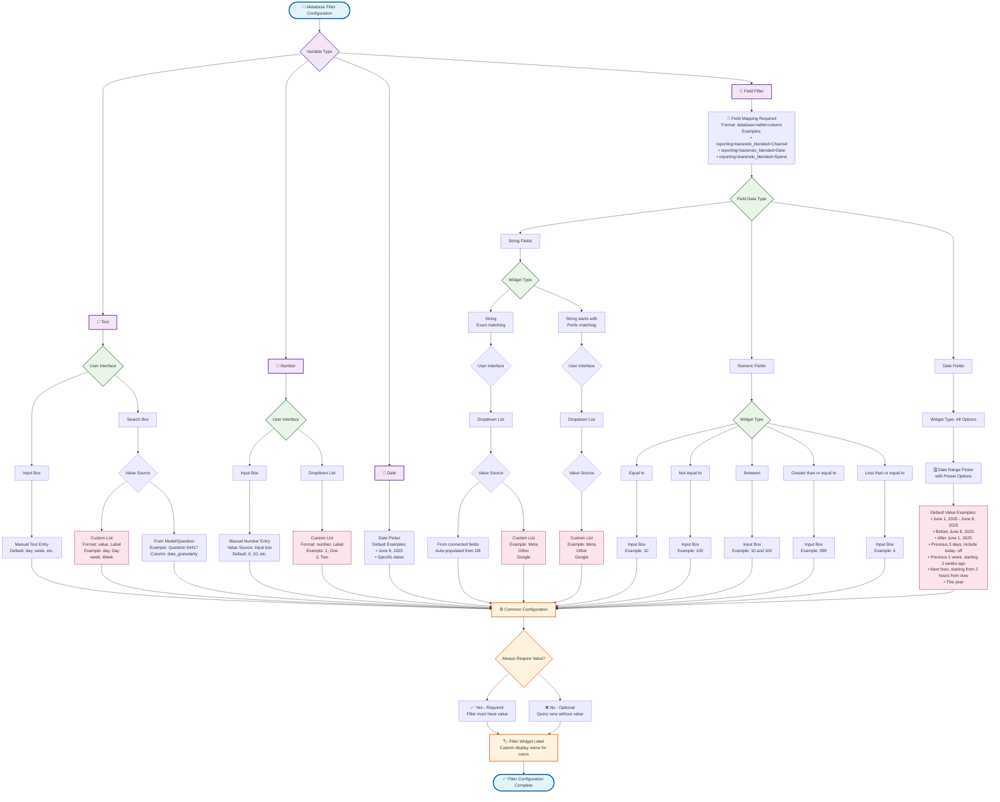

```mermaid
graph TD
    Start([🎯 Metabase Filter Configuration]) --> VarType{Variable Type}
    
    %% Variable Type Branches
    VarType --> Text[📝 Text]
    VarType --> Number[🔢 Number]
    VarType --> Date[📅 Date]
    VarType --> FieldFilter[🔗 Field Filter]
    
    %% TEXT VARIABLE PATH
    Text --> TextUI{User Interface}
    TextUI --> TextInput[Input Box]
    TextUI --> TextSearch[Search Box]
    
    TextInput --> TextInputConfig[Manual Text Entry<br/>Default: day, week, etc.]
    
    TextSearch --> TextSource{Value Source}
    TextSource --> TextCustom[Custom List<br/>Format: value, Label<br/>Example: day, Day\nweek, Week]
    TextSource --> TextModel[From Model/Question<br/>Example: Question 54417<br/>Column: date_granularity]
    
    %% NUMBER VARIABLE PATH
    Number --> NumUI{User Interface}
    NumUI --> NumInput[Input Box]
    NumUI --> NumDropdown[Dropdown List]
    
    NumInput --> NumInputConfig[Manual Number Entry<br/>Value Source: Input box<br/>Default: 0, 10, etc.]
    
    NumDropdown --> NumCustom[Custom List<br/>Format: number, Label<br/>Example: 1, One\n2, Two]
    
    %% DATE VARIABLE PATH
    Date --> DateConfig[Date Picker<br/>Default Examples:<br/>• June 8, 2025<br/>• Specific dates]
    
    %% FIELD FILTER PATH
    FieldFilter --> FieldMap[🎯 Field Mapping Required<br/>Format: database>table>column<br/>Examples:<br/>• reporting>bariendo_blended>Channel<br/>• reporting>bariendo_blended>Date<br/>• reporting>bariendo_blended>Spend]
    
    FieldMap --> FieldType{Field Data Type}
    
    %% STRING FIELD FILTERS
    FieldType --> StringField[String Fields]
    StringField --> StringWidget{Widget Type}
    StringWidget --> StringExact[String<br/>Exact matching]
    StringWidget --> StringPrefix[String starts with<br/>Prefix matching]
    
    StringExact --> StringUI1{User Interface}
    StringPrefix --> StringUI2{User Interface}
    
    StringUI1 --> StringDropdown1[Dropdown List]
    StringUI2 --> StringDropdown2[Dropdown List]
    
    StringDropdown1 --> StringSource1{Value Source}
    StringDropdown2 --> StringSource2{Value Source}
    
    StringSource1 --> StringConnected[From connected fields<br/>Auto-populated from DB]
    StringSource1 --> StringCustomList1[Custom List<br/>Example: Meta\nOther\nGoogle]
    
    StringSource2 --> StringCustomList2[Custom List<br/>Example: Meta\nOther\nGoogle]
    
    %% NUMERIC FIELD FILTERS
    FieldType --> NumericField[Numeric Fields]
    NumericField --> NumericWidget{Widget Type}
    NumericWidget --> Equal[Equal to]
    NumericWidget --> NotEqual[Not equal to]
    NumericWidget --> Between[Between]
    NumericWidget --> GreaterEqual[Greater than or equal to]
    NumericWidget --> LessEqual[Less than or equal to]
    
    Equal --> NumericInput1[Input Box<br/>Example: 10]
    NotEqual --> NumericInput2[Input Box<br/>Example: 100]
    Between --> NumericInput3[Input Box<br/>Example: 10 and 100]
    GreaterEqual --> NumericInput4[Input Box<br/>Example: 999]
    LessEqual --> NumericInput5[Input Box<br/>Example: 4]
    
    %% DATE FIELD FILTERS
    FieldType --> DateField[Date Fields]
    DateField --> DateWidget[Widget Type: All Options]
    DateWidget --> DatePicker[🗓️ Date Range Picker<br/>with Preset Options]
    
    DatePicker --> DateOptions[Default Value Examples:<br/>• June 1, 2025 - June 8, 2025<br/>• Before June 8, 2025<br/>• After June 1, 2025<br/>• Previous 3 days, include today: off<br/>• Previous 1 week, starting 2 weeks ago<br/>• Next hour, starting from 2 hours from now<br/>• This year]
    
    %% COMMON CONFIGURATION OPTIONS
    TextInputConfig --> CommonConfig[⚙️ Common Configuration]
    TextCustom --> CommonConfig
    TextModel --> CommonConfig
    NumInputConfig --> CommonConfig
    NumCustom --> CommonConfig
    DateConfig --> CommonConfig
    StringConnected --> CommonConfig
    StringCustomList1 --> CommonConfig
    StringCustomList2 --> CommonConfig
    NumericInput1 --> CommonConfig
    NumericInput2 --> CommonConfig
    NumericInput3 --> CommonConfig
    NumericInput4 --> CommonConfig
    NumericInput5 --> CommonConfig
    DateOptions --> CommonConfig
    
    CommonConfig --> RequireValue{Always Require Value?}
    RequireValue --> RequireYes[✅ Yes - Required<br/>Filter must have value]
    RequireValue --> RequireNo[❌ No - Optional<br/>Query runs without value]
    
    RequireYes --> FilterLabel[🏷️ Filter Widget Label<br/>Custom display name for users]
    RequireNo --> FilterLabel
    
    FilterLabel --> Complete([✅ Filter Configuration Complete])
    
    %% STYLING
    classDef startEnd fill:#e1f5fe,stroke:#01579b,stroke-width:3px
    classDef varType fill:#f3e5f5,stroke:#4a148c,stroke-width:2px
    classDef interface fill:#e8f5e8,stroke:#1b5e20,stroke-width:2px
    classDef config fill:#fff3e0,stroke:#e65100,stroke-width:2px
    classDef examples fill:#fce4ec,stroke:#880e4f,stroke-width:1px
    
    class Start,Complete startEnd
    class VarType,Text,Number,Date,FieldFilter varType
    class TextUI,NumUI,StringWidget,NumericWidget,FieldType interface
    class CommonConfig,RequireValue,FilterLabel config
    class DateOptions,StringCustomList1,StringCustomList2,NumCustom,TextCustom examples
```